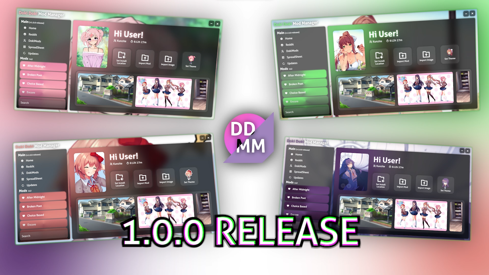

# 💗 (Kunzite) Doki Doki Mod Manager

Doki Doki Mod Manager is a modern, easy-to-use mod manager for Doki Doki Literature Club using Rust + Vue 3.
Doki Doki Mod Manager allows you to directly download from reddit and other sources directly from within the mod manager.

# Prerequisite

DDLC Game Zip - [Here](https://teamsalvato.itch.io/ddlc)

# People Getting Into Modding After Playing The Original Game

Just download the installer and install the mod manager, select the DDLC game zip file! Everything should be set up for you.

# People That Already Have Mods

If you saved all of your mods to a folder, perfect!
Once you install the mod manager and select your DDLC game zip, click on "Set Install Location" and select the folder that contains all of your mods.
It should automatically detect the mods that you have! If it does not, create a git issue with how the folder is structured
and I will try to fix it.

# Features

#### -- Discord RPC
#### -- Playtime Tracker
#### -- Discord RPC

## Custom Backgrounds & Themes

You can set custom background by using the arrows on the cover image of the home page.
You can set custom themes by clicking and cycling through each character on the home page.
You can set custom mod covers by using the arrows on the cover image near the bottom left of the cover.

## Drag & Drop

You can easily drag and drop zipped mods and/or background images anywhere in the mod manager.
Doki Doki Mod Manager whilst open will constantly scan downloads for newly downloaded zip files to import as mods.

# Linux And Mac Support

There are no plans in order to support Linux and Mac. If you are on either of those operating systems, please use the original Doki Doki Mod Manager.
No hate towards the original mod manager. I made this because I had a few things that I wanted that were not in the original mod manager.
Plus, I wanted to do a project that allowed me to get into rust.

# Credits

- SFX + Default background from DDLC [@Team Salvato](https://teamsalvato.com/)
- Monika  BG Image - [reddit - deleted user](https://www.reddit.com/r/DDLC/comments/7xnz27/made_a_169_wallpapercompatible_version_of_the/)
- Yuri    BG Image - [reddit - Peaceablecolt](https://www.reddit.com/r/DDLC/comments/w9h5yr/i_havent_posted_here_in_like_3_years_heres_a/)
- Sayori  BG Image - [twitter - Saschaa_SAN](https://x.com/Saschaa_SAN/status/1533897941928525824)
- Natsuki BG Image - [reddit - The_Fish_Art](https://www.reddit.com/r/DDLC/comments/1ll685l/oc_the_simple_beauty_of_natsuki_202120232025_alts/)