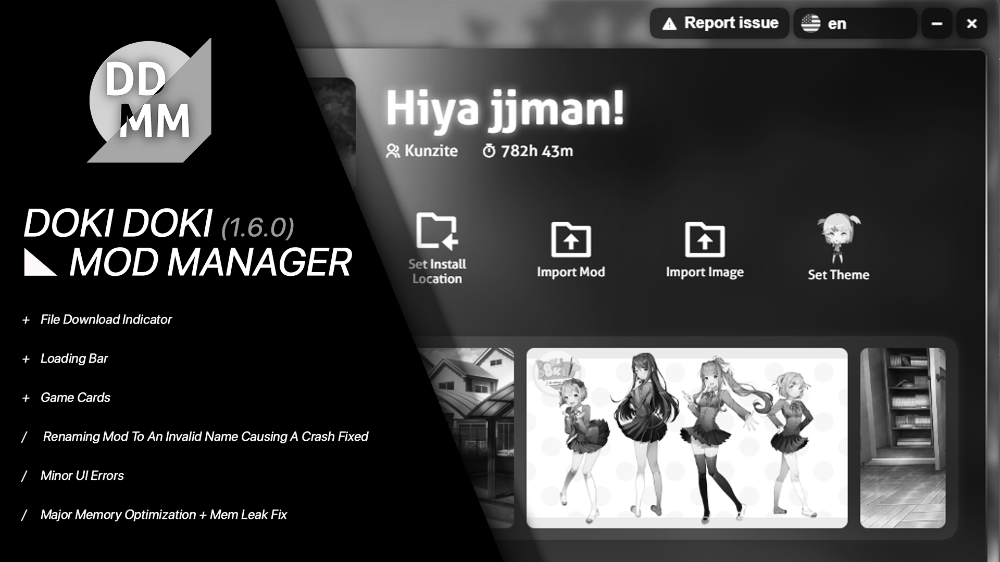

# Doki Doki Mod Manager

## Summary
Doki Doki Mod Manager is a mod manager for Doki Doki Literature Club that uses Rust + Tauri.
The premise behind this mod manager is that it allows you to seamlessly install mods, with its unique ability to install mods directly from its interface, rather than having to download them from your browser and import them manually.
It also comes with many languages, heavy customization options, Discord Rich Presence integration, and profiles. Profiles allow you to have backup save data and to be able to transfer them from PC to PC.
It also allows you to make new save data slots.
It incorporates UnRPYC to support these advanced features.

# Getting Started
### Prerequisites
- DDLC Zip File – [Download Here](https://teamsalvato.itch.io/ddlc)
- Latest Release – [Download Here](https://github.com/BKunzite/Doki-Doki-Mod-Manager/releases)
- Windows 11 (Windows 10 might work, but no testing has been conducted yet)
- For other operating systems, look at [Support For Other Operating Systems](#support-for-other-operating-systems)

### Previous Mods
- You can load mods by clicking on "Set Install Location" on the home page and selecting your old mods folder

### How To Use
- Run Installer (Kunzite Doki Doki Mod Manager_1.x.x_x64-setup.exe or Kunzite Doki Doki Mod Manager_1.x.x_x64_en-US.msi)
- After that, it should automatically run (If it prompts you about the update, click ignore)
- Select your language
- If you are prompted to import a zip, click on it and select the DDLC Zip File downloaded from the [prerequisites](#prerequisites)
- Click on "Install"
- Continue with the built-in tutorial
- After you complete the tutorial, you can then load your old mods using the [instructions above](#previous-mods)

# Features
+ Discord RPC
+ Playtime Tracker
+ Works With Existing Mod Folders
+ UnRPYC Integration
+ Easy Imports That Work With Mods Made With Ren'Py 6–8.x.x
+ Extensive Customization Options
+ Drag & Drop
+ Profiles

### Custom Backgrounds & Themes

You can set a custom background by using the arrows on the cover image of the home page.
You can set custom themes by clicking and cycling through each character on the home page.
You can set custom mod covers by using the arrows on the cover image near the bottom left of the cover.

### Drag & Drop

You can drag and drop zipped mods and/or background images anywhere in the mod manager.
Doki Doki Mod Manager, whilst open, will constantly scan downloads for newly downloaded zip files to import as mods.

# Support For Other Operating Systems

### macOS
There are now plans for Mac support this summer. It will likely come out sometime in August 2026.

### Linux-Based Operating Systems
There are currently no plans to support Linux. If you are on any Linux-based operating system, please use the original Doki Doki Mod Manager.

# Credits

- SFX + Default background from DDLC [@Team Salvato](https://teamsalvato.com/)
- Monika  BG Image - [Reddit - deleted user](https://www.reddit.com/r/DDLC/comments/7xnz27/made_a_169_wallpapercompatible_version_of_the/)
- Yuri    BG Image - [Reddit - Peaceable colt](https://www.reddit.com/r/DDLC/comments/w9h5yr/i_havent_posted_here_in_like_3_years_heres_a/)
- Sayori  BG Image - [Twitter - Sascha_SAN](https://x.com/Saschaa_SAN/status/1533897941928525824)
- Natsuki BG Image - [Reddit - The_Fish_Art](https://www.reddit.com/r/DDLC/comments/1ll685l/oc_the_simple_beauty_of_natsuki_202120232025_alts/)

This software uses unrpyc, developed by CensoredUsername and others.
Source: https://github.com/CensoredUsername/unrpyc

unrpyc License (MIT):
Copyright (c) 2012-2024 CensoredUsername
