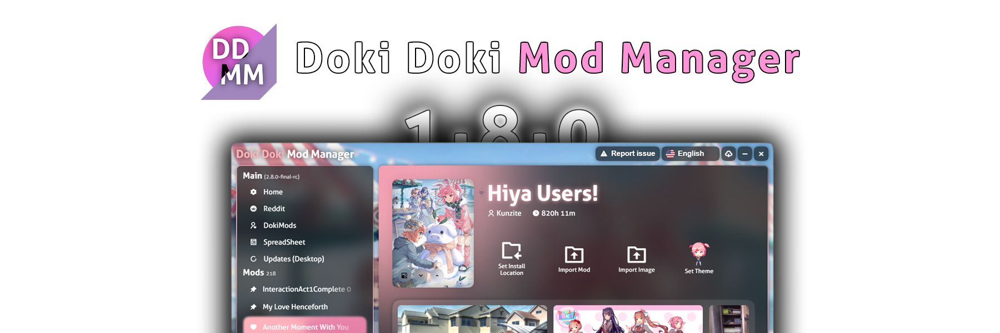

 

## Summary
Doki Doki Mod Manager is a mod manager for Doki Doki Literature Club that uses Rust + Tauri.
The core concept behind this mod manager is that it allows you to seamlessly install mods with its unique ability to install mods directly from the internet, rather than having to download them from your browser and manually import.
It also supports many different languages, heavy customization options, Discord Rich Presence integration, and profiles. Profiles allow you to back up and save data, create a new playthrough, or transfer them from PC to PC.
Doki Doki Mod Manager incorporates UnRPYC to support these advanced features.

# Features
+ Discord RPC
+ Playtime Tracker
+ Works With Existing Mod Folders
+ UnRPYC Integration
+ Easy Imports That Work With Mods Made With Ren'Py 6–8.x.x
+ Extensive Customization Options
+ Drag & Drop
+ Profiles

# Getting Started
### Prerequisites
- DDLC Zip File – [Download Here](https://teamsalvato.itch.io/ddlc)
- Latest Release – [Latest Releases Here](https://github.com/BKunzite/DokiModManager/releases)
- Modern-Ish Operating System 
  - Windows: 10/11
  - Linux: Most Common Distributions w/WebKit2GTK 4.1
  - MacOS: BigSur 11 with a M1, M2, etc.
    MacOS Support Goes Into Alpha (With a caveat)!
    - The MacOS app will not be signed.
      To be signed, I have to pay a $99/yr subscription.
      So for now, the app will not be signed.
      This means you have to allow the app through gatekeeper
      Follow this guide to allow the app through gatekeeper:
      https://tinyurl.com/4cjw2md7
### Previous Mods
- You can load mods by clicking on "Set Install Location" on the home page and selecting your old mods folder

### How To Use
- Run The Installer (**_Kunzite Doki Doki Mod Manager_1.x.x_x64-setup.exe_** or _**Kunzite Doki Doki Mod Manager_1.x.x_x64_en-US.msi**_)
  - For Linux Users, Use: 
  _**Kunzite Doki Doki Mod Manager_1.x.x_amd64.deb**_ (for debian-based distros),  
  _**Kunzite Doki Doki Mod Manager-1.x.x-1.x86_64.rpm**_ (for fedora-based distros), or  
  _**Kunzite Doki Doki Mod Manager-x86_64.AppImage**_ (for arch/other distros)
- After that, run the **program**
- Select your **language**
- If you are prompted to import a zip, **click on it and select the DDLC Zip File downloaded from the [prerequisites](#prerequisites)**
- Click on **"Install"**
- Continue with the **built-in tutorial**
- After you complete the tutorial, you can then load your old mods using the **[instructions above](#previous-mods)**

### Custom Backgrounds & Themes

You can set a custom background by clicking on the image icon on the image icon on the smaller picture of the background on your home page.
You can set custom themes by clicking and cycling through each character on the home page.
You can set custom mod covers by clicking on the image icon in the cover image near the bottom left.

### Drag & Drop

You can drag and drop zipped mods and/or background images anywhere in the mod manager.
Doki Doki Mod Manager, whilst open, will constantly scan downloads for newly downloaded zip files to import as mods.

# Roadmap

1.8.0 is feature complete. The expected release date is Wednesday (23) or Thursday (24) of September.

| Tasks (Descending Importance For 2.0.0) | Time Required | Completed? |
|---------------------------------------|--------------|------------|
| Resizing                              | 1 - 2 Week(s) | &#9744;    |
| Docker Integration                    | 2 - 3 Week(s) | &#9744;    |

MacOS Support Will Be Included In 1.8.0
  Resizing Might Be Done To Support More Systems
  Docker Will Likely Not Be Added Unless Requested By A Majority

# Support For Non-Windows-Based Operating Systems

### macOS (BigSur 11 and newer with an Mx chip (M1, M2, etc.))
The macOS build is currently in alpha. Expect bugs to come from this version.
The macOS build will go outside of beta once 2.1.0 (26.xx.xx/27.xx.xx) comes out.
#### Known MacOS Issues:
- WebGTK rendering artifacts
- Downloads Randomly Not Starting (WebGTK Issue)
  - You might have to just import the mod ZIP file
    downloaded from your browser
- There is no Update System for MacOS, Update Manually Via GitHub
- Some Mods May Not Load (Not all mods support linux)
- Non-Resizeable Window (A full UI update would have to be done)
  - This may cause an issue for tiling managers

### Linux-Based Operating Systems
The linux build is currently in beta. Expect bugs to come from this version.
The linux build will go outside of beta once 2.0.0 (26.xx.xx/27.xx.xx) comes out.
#### Known Linux Issues:
- WebGTK rendering artifacts
- Downloads Randomly Not Starting (WebGTK Issue)
  - You might have to just import the mod ZIP file
    downloaded from your browser
- Current Update System May Be Broken, If So, Update Manually Via GitHub
- Some Mods May Not Load (Not all mods support linux)
- Non-Resizeable Window (A full UI update would have to be done)
  - This may cause an issue for tiling managers
- Slow Loading Times
- No Window Blur Transparency Support
- Non-Debian Users May Have Other Issues

# Credits

- SFX + Default background from DDLC [@Team Salvato](https://teamsalvato.com/)
- Monika  BG Image - [Reddit - deleted user](https://www.reddit.com/r/DDLC/comments/7xnz27/made_a_169_wallpapercompatible_version_of_the/)
- Yuri    BG Image - [Reddit - Peaceable colt](https://www.reddit.com/r/DDLC/comments/w9h5yr/i_havent_posted_here_in_like_3_years_heres_a/)
- Sayori  BG Image - [Twitter - Sascha_SAN](https://x.com/Saschaa_SAN/status/1533897941928525824)
- Natsuki BG Image - [Reddit - The_Fish_Art](https://www.reddit.com/r/DDLC/comments/1ll685l/oc_the_simple_beauty_of_natsuki_202120232025_alts/)
- UnRPYC - https://github.com/CensoredUsername/unrpyc

# Support This Project
If you like this project, you can support it via [Buy Me A Coffee](https://www.buymeacoffee.com/bkunzite) or by starring this project on GitHub!